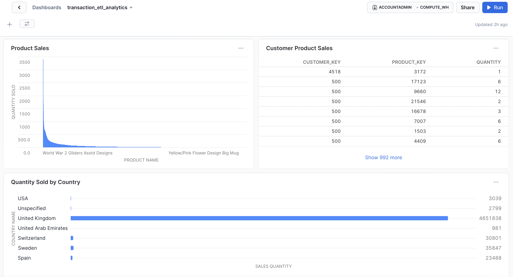

# Reproducible ETL
A Reproducible ETL Pipeline to process CSV file in Python

## Project Overview

Engineered a reproducible ETL pipeline - Extract, Transform and Load and Database Warehousing tool with an analytics Dashboard.

`Objectives`
1. Create and write ETL scripts.
2. Read and extract the data from a sample CSV file.
3. Perform activities like data cleaning, data manipulation, data transformation, data validation and error handling.
4. Data Load onto an on-premises Database.
5. Transformed and cleaned data to make useful analytics and create insights.

## Installation

Here are the steps to run the code. 

I packaged the necessary libraries and packages in my virtual environment  `venv`. 

From the terminal run: 
```
# First load necessary libraries and packages
source venv/bin/activate

# run the main.py file
python3 main.py
```

For Testing: 
```
# Run unit tests from the project directory
pytest
```
## Project Description
`Process`

For this project, I took an E-commerce Transaction open-source data source in a CSV file format.  

Assuming the project requirements and scope, I wanted to set up an ETL pipeline to process, clean, manipulate and transform data for analysis.

I observed errors and mistakes in the data sources and addressed them by restructuring, changing column names to a standard format, dropping empty rows and fields, duplicating rows and null or NA data.

I addressed security, scalability and maintainability during the development.

I achieved a clean, readable and resuable code by follwing the high quality industry standards like Object-Oriented Programming, Test Driven Developmnet, Pytest and SOLID code.

1.  Read and extract the data from a sample csv file Data source file path: ```data/transaction-data.csv```.
2. Carried out Data Cleansing process using `Python` and `Pandas`.
3. Data Manipulation on necessary data frames and columns using `NumPy`.
4. Data Validation on the expected input.
4. Load the data in on-premise SQL server(PostgreSQL).using `SQLAlchemy`.
5. Tested each function with 100% test coverage with the `Pytest` Unit Testing module.
6. Logged the information during ingestion and for security issues for troubleshooting purposes.
7. Error Handling with appropriate exception handling using try and except blocks.
8. Hosted the transformed data on the `Snowflake` Data Warehouse.
 
## Data Visualization

Using the Transformed data, I developed a dashboard on ```Snowflake Data Warehouse```

Generated Key Insights and interactive dashboard to drive business value.

`Click on the below link to go to Dashboard:`

[DATA VISUALIZATION](https://app.snowflake.com/spdfstt/ho28355/#/transaction_etl_analytics-d8kMeNV8)



## Conclusion

I have achieved a Reproducible ETL Pipeline, which is scalable, highly manageable and efficient with optimal transformation and maintenance in DB.

Followed best coding practices and delivered an analytics dashboard for key insights.

## Credits
* Data Source [Link to dataset](https://www.kaggle.com/datasets/gabrielramos87/an-online-shop-business?resource=download)

<!-- - To run:

- Data file:
- Assumptions:
- Extract:
- Transform:
- Load:
- Pytest:
- Log:

- Future Work:
Data Warehousing, AirFlow, Automate data crawling using AWS Glue, Build Analytics, ML Predictive Analysis etc.
- Enhancement: -->


